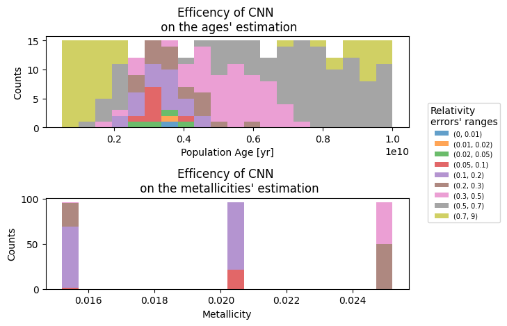
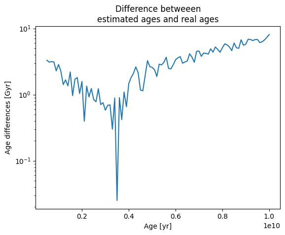

# StarNet
Library for identifing the properties of a star's simple population using a convolutional Neural Network

## Example Usage
The library works on four step:

1) Loading the isochrones from the [CMD website](http://stev.oapd.inaf.it/cgi-bin/cmd) using [ezpadova](https://github.com/mfouesneau/ezpadova) package:
    ```
    #Import the train module
    import StarNet.train

    #Load the isochrones from the CMD website
    isochrones=StraNet.train.load_data(min_age=5e8,max_age=1e10,age_step=1e8,Z_step=0.005)
    ```
    - The loaded isochrones are presented as a pandas DataFrame where the keys are each one a tuple containig the log(Age) and the initial maetallicity (Z) of each population retrived form the CMD site.

2) Transform the isochrones in synthetic diagrams:
    ```
    #Generate the DataFrame containing the synthetic diagrams
    synthetics=StraNet.train.generate_synthetic_diagrams(df,Nsamples=1e4)
    
    #Generates the arraies to train the CNN
    immages,labels,axies_limits=StraNet.train.generate_immages_and_labels(synthetics)
    ```

    - The default settings for generating the immages are aviable in the [source code](StarNet/train.py), the most relevant are:

        - xlim=(-1,5)
        - ylim=(15,-45)
        - x_key='BP-RP'
        - y_key='Gmag'

        Therfore the standar immages are generated to train the CNN for the GAIA photometry.

    - Is possibple to show the immages as follow:
        ```
        import matplotlib.pyplot as plt
        _,ax=plt.subplots(1,1,figsize=(12,12))
        StraNet.train.plot_image(immages[0],ax,axies_limits[0])
        ```

3) Create the CNN model and train it:
    ```
    import StarNet

    #Import the CNN class ('the class constructor try to 
    #import the default.pkl model if it's present in the 
    #default_models folder, else raise an error, but the 
    #class is redy to be trained')
    CNN=StraNet.CNN()

    #Train the model
    CNN.train_model(immages,labels,X_val=None,y_val=None, model='default', epochs=30, batch_size=10,test_size=0.2, random_state=42)
    ```
    - The standard CNN model has(other model must be implemented):
        - 2 Convolutional layer followed by a Max pooling layer
        - 1 Flatten layer
        - 1 Dense layer coposed by 128 neuron
        - 1 Dense layer coposed by 2 neuron to estimate the 2 value
    - Is possible to pass a validation set, in this case the array immages and labels are used only for the training
    - The labels for the different immages must be compose by a tuple containing (log(age),Z)

4) Predict the age and the initial metallicty of a simple population:
    ```
    #Assuming a DataFrame containg the data of an CMD of a simple population
    immage_to_predict=StarNet.generate_immage(df,x_key,y_key)

    #Predict the age and metallicity the population
    prediction=CNN.predic(immage_to_predict)
    age=prediction[0][0] #age in yr
    Z=prediction[0][1]#Metallicity
    ```
    - NOTE: the prediction is given as an array containing a 2X1 array where the first number rappresent the age in yr and the second the metallicity

5) It's also possible to save and load the trained CNN from the [default_models](StarNet/default_models) folder:
    ```
    #Choose the name of the model
    CNN.default_file_name='my_default.pkl'

    #Save model
    CNN.save_default_model()#Save the file with the name CNN.default_file_name

    #load model
    CNN.load_default_model()#load the file with the name CNN.default_file_name

    ```
## Usefull fucntionalities

### CNN class
The StarNet.CNN class as also other usefull functionality:
```
#Show the graph about the loss function obtained during the training
CNN.plot_loss()

#Show the graph about the Mean Absolute Error function obtained during the training
CNN.plot_mae()
```
## Efficency estimation
The CNN trained with isochrones in the age range of (5e8,1e10) [yr] with a age's step of 1e8 [yr], have the following efficency in the parameter estimation:


*__Fig.1__: Histogram of synthetic data distribution as a function of age and metallicity. The figure shows the quantity of synthetic diagrams within each percentage error range specified in the legend for age and metallicity estimation.*

To understand the distribution of errors shown in __Fig.1__, it is important to examine the difference between the estimated age and the actual age. As seen in __Fig.2__, the minimum error occurs for ages around 3.5 Gyr.

*__Fig.2__:Diffrences between the estimated age by the CNN and the real age of the synthetic diagram as function of the population's age.*
When representing the isochrones (__Fig.3__), it becomes evident that the synthetic diagrams for ages close to 10 Gyr are nearly overlapping. On the other hand, for diagrams with ages near 0.5 Gyr, the relative error is greater. Moreover, the density of points near the turn-off is lower, as the various populations are better separated, which reduces the estimation efficiency of the CNN.

*__Fig.3__:Scatter plots of Synthetic diagrams with metallicity=0.0152 and ages between (0.5,10) Gyr.*

### Possible Improvements

To enhance the accuracy of the CNN estimation, the following steps could be implemented:

- **Increase the number of synthetic diagrams for younger ages**: Adding more samples at lower ages would improve density and enhance the CNN’s ability to estimate values accurately.

- **Improve image resolution**: For example, increasing the number of histogram bins could help distinguish diagrams, particularly at higher ages.

- **Adjust the final CNN layer**: Modify the last layer to produce both a continuous output for age estimation and a discrete output for metallicity estimation, given that only three distinct metallicities are present in the current training dataset.

- **Expand metallicity range in the training dataset**: Including additional metallicities would further improve the model's capacity to generalize.